## Geoffrey Fox

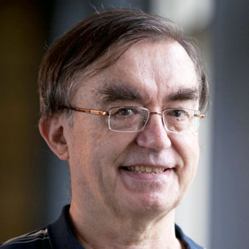

Geoffrey Fox received a Ph.D. in Theoretical Physics from Cambridge
University and is now professor of Informatics and Computing, and
Physics at Indiana University as well as director of the Digital Science
Center and Associate Dean for Research and Graduate Studies at the
School of Informatics and Computing. He currently works in applying
computer science to Bioinformatics, Defense, Earthquake and Ice-sheet
Science, Particle Physics and Chemical Informatics and is principal
investigator of FutureGrid - a new facility to enable development of new
approaches to computing. He is involved in several projects to enhance
the capabilities of Minority Serving Institutions.

## Shantenu Jha

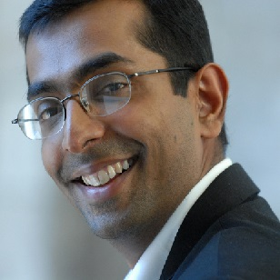

Prof. Shantenu Jha is an Associate Professor at Rutgers University, a
member of the Graduate Faculty in the School of Informatics at the
University of Edinburgh (UK), and a Visiting Scientist at University
College London. Before moving to Rutgers, he was the lead for
Cyberinfrastructure Research and Development at the CCT at Louisiana
State University. His research interests lie at the triple point of
Applied Computing, Cyberinfrastructure R&D and Computational Science.
Shantenu is the PI of RADICAL and the lead investigator of
RADICAL-Cybertools (including SAGA http://www.saga-project.org), which
is a community standard and is part of the official middleware/software
stack of most major Production Distributed Cyberinfrastructure - such as
US NSF's XSEDE and the European Grid Infrastructure.

## Gregor von Laszewski

Gregor von Laszewski is an Assistant Director of CGL and DSC in the
Digital Science Center, School of Informatics and Computing, Indiana
University, and an Adjunct Associate Professor at Indiana University in
the Computer Science department. He is currently conducting research in
cloud computing. He held a position at Argonne National Laboratory from
Nov. 1996 - Aug. 2009 where he was a scientist and a fellow of the
Computation Institute at University of Chicago. During the last two
years of that appointment he was on sabbatical and held a position as
Associate Professor and the Director of a Lab at Rochester Institute of
Technology focusing on Cyberinfrastructure. He received a Masters Degree
in 1990 from the University of Bonn, Germany, and a Ph.D. in 1996 from
Syracuse University in Computer Science. He has been involved in Grid
computing since the term was coined. Current research interests are in
the areas of cloud computing.

## Judy Qiu

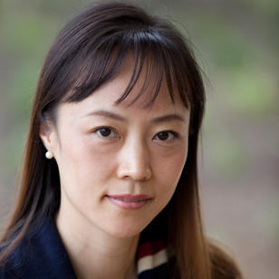

Dr. Qiu is an assistant professor of Computer Science at Indiana
University. She graduated from Syracuse University with an Outstanding
Graduate Student Award, completing her Ph.D. in Computer Science in
2005. She leads the SALSA project, encompassing data-intensive computing
at the intersection of Cloud and multicore technologies, and offers an
online course CloudMOOC as part of the Data Science Program of the
School of Informatics and Computing. Her research has been funded by
NSF, NIH, Microsoft, Google and Indiana University. She is the recipient
of a NSF CAREER Award in 2012 and Indiana University Trustees Award For
Teaching Excellence in 2013-2014.

## Madhav V. Marathe

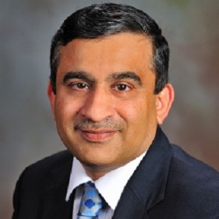

Marathe is an expert in interaction-based modeling and the simulation of
large, complex biological, information, social, and technical systems.
As the Director of the Network Dynamics and Simulation Science
Laboratory, he leads the basic and applied research program where
researchers are advancing the science and engineering of co-evolving
complex networks and developing innovative computational tools based on
these advances to support policy informatics. Marathe is an ACM Fellow
for his contributions to high-performance computing algorithms and
software environments for simulating and analyzing socio-technical
systems. Marathe is also named a Fellow of IEEE for his contributions to
the development of formal models and software tools for understanding
socio-technical networks.

## David Crandall

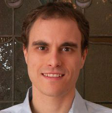

David Crandall received a Ph.D. in computer science from Cornell
University in 2008 and M.S. and B.S. degrees in computer science and
engineering from Pennsylvania State University in 2001. He worked as a
postdoctoral associate at Cornell from 2008-2010, and as a research
scientist at Eastman Kodak Company from 2001-2003. His main research
interest is computer vision, the area of computer science that tries to
design algorithms that can “see”. He is particularly interested in
visual object recognition and scene understanding. He is also interested
in other problems that involve analyzing and modeling large amounts of
uncertain data, notably in mining data from the web and from online
social networking sites.

## Oliver Beckstein 

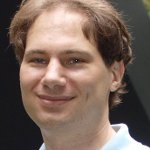

Oliver Beckstein leads the `Computational Biophysics research group`_ in
the Center for Biological Physics and the Department of Physics at
Arizona State University. He received his DPhil in Biochemistry from
the University of Oxford in 2005 and his Diplom in Physics from the
University of Erlangen-Nuremberg, Germany in 1999. He was a Junior
Research Fellow at Merton College, Oxford, and a postdoctoral fellow
at Johns-Hopkins University and the University of Oxford. His lab uses
computational approaches such as molecular dynamics simulations in
order to understand the function of biomolecules, in particular
membrane proteins, at the molecular level.

.. _Computational Biophysics research group:
   http://becksteinlab.physics.asu.edu

## Fusheng Wang

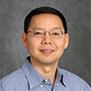

Dr. Wang is an Assistant Professor in the Department of Computer Science
and the Department of Biomedical Informatics at Stony Brook University.
He received his Ph.D. in computer science from the University of
California, Los Angeles. Before coming to Stony Brook, Wang was an
assistant professor at Emory University; he was a research scientist at
Siemens Corporate Research before joining Emory University. Dr. Wang’s
research interests include Scalable Big Data Management and Analytics,
Spatial and Temporal Data Management and Analytics, Medical Imaging
Informatics, Clinical Natural Language Processing, Data Semantics and
Standardization. He will lead the research and development of the
project's spatial queries and analytics algorithms, and collaborate with
Dr. Jun Kong on researching and developing a pathology image analysis
library. He alsohopes to work with GIS/spatial and pathology informatics
communities on evaluating and adopting the proposed libraries and
systems.

## Jun Kong

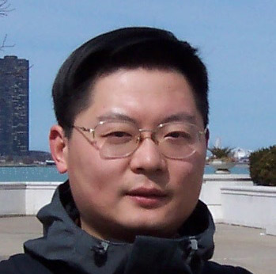

Dr. Kong is an assistant professor at the Department of Biomedical
Informatics, Emory University. His research interests include biomedical
image analysis, computer-aid diagnosis, machine learning, whole-slide
microscopy image processing, computer vision, bio-imaging informatics,
and signal processing for large-scale biomedical translational research.
He received his Ph.D. in Electric Engineering from Ohio State
University. He will collaborate with Dr. Fusheng Wang on the development
of pathology image analysis algorithms for both 2D and 3D images, as
well as co-advise graduate students on image algorithm development.

## Andre Luckow

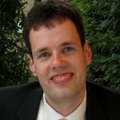

Andre Luckow is a consultant in the SAGA Group. He studied Computer
Science at the Potsdam University where he obtained his doctorate degree
in 2009. His main research interests are distributed systems, fault
tolerance, computational sciences and programming languages.

## Ioannis Paraskevakos

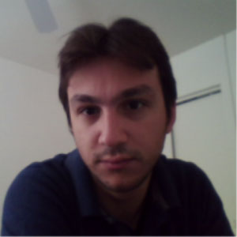

Ioannis Paraskevakos is a first year PhD student at Rutgers University
and a new member at RADICAL lab. Before his PhD studies, he acquired a
diploma (5-year studies) in Computer Engineering and Informatics, a
Master of Science in Integrated Hardware and Software Systems, and has
worked for three-and-a-half years as an IC Design Engineer at an IP
Semiconductor Company in Greece.

## John Paden

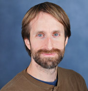

Dr. John Paden is an associate scientist at the Center for Remote
Sensing of Ice Sheets (CReSIS) at the University of Kansas where he
leads the signal and data processing efforts for the center. He
previously worked for Vexcel Corporation as a system engineer for radars
and related technologies including work on a 3D imaging algorithm and
system. His research focuses on sounding and imaging radar systems and
data analysis and interpretation from these systems.

## Theresa Stumpf

Theresa Stumpf is a graduate student at the University of Kansas working
on developing new ultra-broad bandwidth 3-D imaging algorithms and
applying these algorithms to ice sheet bed mapping using multichannel
radar depth sounder data collected by the Center for Remote Sensing of
Ice Sheets (CReSIS).

